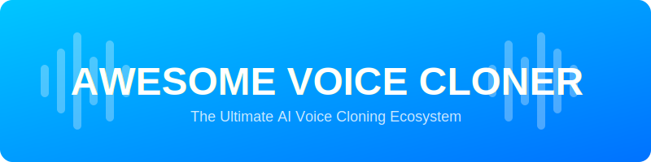

  

  # 🎙️ Awesome Voice Cloner
  ### **The Definitive Guide to AI Voice Cloning, Text-to-Speech (TTS), and Voice Replication**

  
  
  
  

  **A curated list of high-fidelity SaaS platforms and powerful open-source projects for personal voice cloning.**  
  *Master the art of digital voice replication for podcasts, games, accessibility, and content creation.*

---

## 🔍 SEO & Meta Info
**Keywords:** `AI Voice Cloning`, `Voice Replication`, `Text-to-Speech`, `TTS`, `ElevenLabs Alternative`, `Open Source TTS`, `RVC`, `XTTS-v2`, `AI Dubbing`, `Voice Conversion`, `Real-time Voice Changer`.

---

## 📖 Introduction
This repository tracks the rapidly evolving **AI voice cloning ecosystem**. We focus on **personal voice cloning** — systems that can replicate *your* specific voice from as little as 3 seconds of audio. Whether you are a developer building a voice agent, a creator looking for perfect dubbing, or an enthusiast exploring the latest in RVC and TTS, this guide has you covered.

---

## 🛠️ Table of Contents
- [🚀 SaaS Products](#-saas-products)
  - [Core Platforms](#core-platforms-instant-personal-voice-cloning)
  - [Advanced Tools](#advanced--specialized-cloning-tools)
- [💻 Open-Source GitHub Projects](#-open-source-github-projects)
  - [Dedicated Projects](#dedicated-personal-voice-cloning-projects)
  - [Frameworks](#frameworks-for-building-custom-cloners)
- [🤝 How to Contribute](#-how-to-contribute)
- [⚖️ Disclaimer](#-disclaimer)

---

## 🚀 SaaS Products

### Core Platforms (Instant Personal Voice Cloning)

| Name | First Accelerator | Pricing / Free Tier | Key Features |
| :--- | :--- | :--- | :--- |
| **[ElevenLabs](https://elevenlabs.io/)** | None | Free (10k credits/mo) \| Starts $5/mo | 🏆 Industry leader. Instant & PVC, emotional control, 29+ languages. |
| **[Play.ht](https://play.ht/)** | **YC** (W23) | Free (5k words/mo) \| Starts $19/mo | ⚡ Fast, high-quality cloning. Real-time TTS & powerful API. |
| **[Resemble.ai](https://www.resemble.ai/)** | **YC** (W19) | Pay-as-you-go ($0.0005/sec) | 🛡️ Real-time cloning + speech-to-speech. Strong ethical safeguards. |
| **[Cartesia](https://cartesia.ai/)** | **YC** (S25) | Free (10k credits/mo) \| Starts $5/mo | 🏎️ Ultra-low-latency (sub-40ms). Perfect for AI voice agents. |
| **[Fish Audio](https://fish.audio/)** | None | Free (8k credits/mo) \| Starts $5.50/mo | 🎭 Emotional & multilingual. High-fidelity and budget-friendly. |

### Advanced & Specialized Cloning Tools

| Name | First Accelerator | Pricing / Free Tier | Focus Area |
| :--- | :--- | :--- | :--- |
| **[Descript Overdub](https://www.descript.com/overdub)** | None | Free (1hr transcription/mo) \| Starts $12/mo | 🎬 Seamless podcast/video editing. Replace your own words via text. |
| **[Murf.ai](https://murf.ai/)** | **Antler** (India) | Free (10 mins total) \| Starts $19/mo | 🎙️ Studio-quality cloning with emotional range. Ideal for narration. |
| **[LOVO.ai](https://lovo.ai/)** | **500 Global** | Free (20 mins trial) \| Starts $24/mo | 📺 Marketing & explainer videos. Strong multilingual templates. |
| **[Typecast](https://typecast.ai/)** | **500 Global** | Free (5 mins download/mo) \| Starts $8.99/mo | 👤 Instant cloning with very short samples & friendly UI. |

---

## 💻 Open-Source GitHub Projects

### Dedicated Personal Voice Cloning Projects

| Project Name | Backing Org / Accelerator | Description |
| :--- | :--- | :--- |
| **[OpenVoice](https://github.com/myshell-ai/OpenVoice)** | **Binance Labs** (MyShell) | 🌐 Instant zero-shot cloning with granular emotion & accent control. |
| **[Coqui TTS (XTTS-v2)](https://github.com/coqui-ai/TTS)** | None (Mozilla Spin-off) | 🛠️ Advanced toolkit; cloning from 6s of audio. 17+ languages. |
| **[RVC WebUI](https://github.com/RVC-Project/Retrieval-based-Voice-Conversion-WebUI)** | Community | 🎤 Popular real-time conversion. Huge ecosystem for singing/gaming. |
| **[GPT-SoVITS](https://github.com/RVC-Boss/GPT-SoVITS)** | Community | 🌊 Few-shot personal cloning/TTS. Excellent emotion control. |
| **[Fish Speech](https://github.com/fishaudio/fish-speech)** | Fish Audio | 🐟 Expressive multilingual TTS with built-in cloning. Top-tier. |
| **[Seed-VC](https://github.com/Plachtaa/seed-vc)** | Community | ⚡ Zero-shot real-time conversion (~300ms latency). Low-data fine-tuning. |
| **[CosyVoice](https://github.com/FunAudioLLM/CosyVoice)** | Alibaba | 🏢 Alibaba’s model; zero-shot cross-lingual cloning & streaming. |
| **[Tortoise TTS](https://github.com/neonbjb/tortoise-tts)** | Community | 🐢 High-fidelity multi-voice cloning. Premium, audiobook quality. |
| **[VibeVoice](https://github.com/microsoft/VibeVoice)** | Microsoft | ☁️ Microsoft open-source stack for TTS + cloning (local). |
| **[StyleTTS 2](https://github.com/yl4579/StyleTTS2)** | Research (Individual) | 🎨 Style-based TTS with strong personal cloning & expressive control. |
| **[F5-TTS](https://github.com/SWivid/F5-TTS)** | Research (Individual) | 🚀 Fast, high-quality non-autoregressive cloning. |

---

## 🔧 Frameworks for Building Custom Cloners
Use these models with Gradio WebUIs, ComfyUI pipelines, or LangChain-style orchestration for fully custom personal voice agents.

---

## 🤝 How to Contribute

We love contributions! 💖
1. **Fork** the repository.
2. **Add** your favorite tool/project to the relevant table.
3. **Ensure** you include the First Accelerator, Pricing, and a clear Description.
4. **Submit** a Pull Request.

---

## ⚖️ Disclaimer
- This list is **community-curated** and for informational purposes only.
- **Ethical Use:** Always obtain explicit consent before cloning a voice. Avoid creating deepfakes or misinformation.
- **Privacy:** Be aware of the data privacy policies of SaaS providers.

---

  <h3>✨ Star History</h3>
  <a href="https://star-history.com/#ishandutta2007/Awesome-Voice-Cloner&Date">
    <picture>
      <source media="(prefers-color-scheme: dark)" srcset="https://api.star-history.com/chart?repos=ishandutta2007/Awesome-Voice-Cloner&theme=dark" />
      <source media="(prefers-color-scheme: light)" srcset="https://api.star-history.com/chart?repos=ishandutta2007/Awesome-Voice-Cloner" />
      
    </picture>
  </a>

   

  **Made with ❤️ for the AI Voice Community.**  
  *Keep replicating, keep innovating!*

